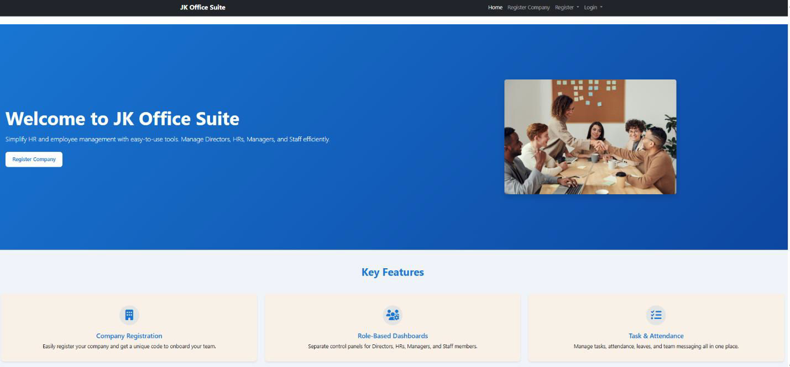

# 🏢 JK Office Suite

### Enterprise Employee Management System

> A Django-based enterprise platform for employee management, QR attendance, task tracking, payroll management, recruitment workflows, and organizational analytics.

🌐 **Live Demo:** https://jk-office-suite.onrender.com

---

## 📸 Preview

### 🏠 Home Page



---

## ✨ Highlights

🔐 Multi-Role Authentication

📱 QR-Based Attendance System

📋 Task Assignment & Tracking

💰 Payroll & Payslip Management

👥 Employee Management

📄 Recruitment Workflow

📊 Director Analytics Dashboard

📧 Email Notifications

---

## 🏗 Architecture


---

## 👨‍💼 Role-Based Modules

| Role | Responsibilities |
|--------|----------------|
| Director | Organization Analytics, Employee Oversight |
| HR | Recruitment, Payroll, Employee Management |
| Manager | Task Assignment, Team Monitoring |
| Staff | Attendance, Tasks, Leave Requests |

---

## 🛠 Tech Stack

**Backend**
- Python
- Django
- Django REST Framework

**Frontend**
- HTML5
- CSS3
- Bootstrap

**Database**
- MySQL

**Additional Features**
- QR Code Attendance
- Email Automation
- PDF Generation

---

## 🚀 Key Workflows

### Attendance Workflow

```text
QR Attendance → Verification → Attendance Record
```

### Task Workflow

```text
Manager Assigns Task → Staff Executes → Submission → Review
```

### Leave Workflow

```text
Staff Request → Manager Review → Approval / Rejection
```

---

## ⚙ Installation

```bash
git clone https://github.com/vaishnavi121001/JK-office-suite.git

cd JK-office-suite

pip install -r requirements.txt

python manage.py migrate

python manage.py runserver
```

---

## 👩‍💻 Developer

**Vaishnavi Tijare**

Software Developer | Python • Django • Next.js • AI Applications

📧 tijarevaishnavi12@gmail.com

💼 LinkedIn  
https://www.linkedin.com/in/vaishnavi-tijare-71b4522a9

---

⭐ If you found this project interesting, consider giving it a star.
